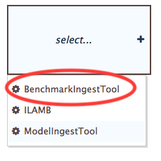
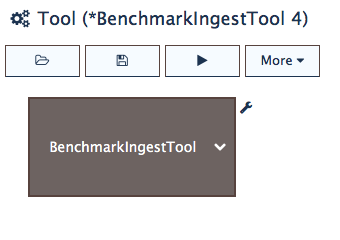
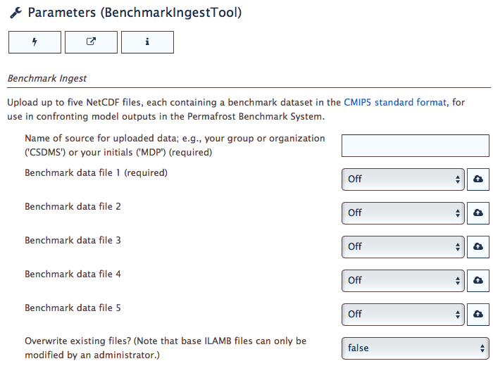

Using the BenchmarkIngestTool
=============================

If you have benchmark data 
that conform to the
`format <https://ilamb.ornl.gov/doc/format_data.html>`_
expected by ILAMB,
you can upload them to the PBS for use in benchmarking analyses.
In the PBS,
benchmark data filenames are expected to take the following form:

.. code-block:: bash

   <variable-name>[_<lon-resolution>x<lat-resolution>].nc

where ``<variable_name>``
is a CMIP5 short variable name
described `here <https://cmip.llnl.gov/cmip5/output_req.html#req_list>`_. 
For example:

.. code-block:: bash

   snd.nc
   lai_0.5x0.5.nc

To begin,
from the main PBS window
select the **BenchmarkIngestTool**
from the list of tools in the :ref:`tool-panel`,
as shown in :numref:`fig-select-bit`.

.. _fig-select-bit:

   Selecting the BenchmarkIngestTool.

Once selected,
the PBS gives a generic title to the new tool.
A more specific title can chosen when
:doc:`saving the tool<save-tool>`.

.. _fig-bit-selected:

   The BenchmarkIngestTool selected in the Tool panel.

When the BenchmarkIngestTool loads,
its parameters are displayed
in the the :ref:`parameters-panel`.

.. _fig-bit-parameters:

   The BenchamrkIngestTool parameters displayed in the PBS Parameters panel.

As shown in :numref:`fig-bit-parameters`,
up to five benchmark data files can be uploaded
and processed simultaneously through this tool.
Files are uploaded locally from your computer.
If you have more than five files to upload,
you can create multiple instances of the BenchmarkIngestTool.

The last parameter in the table provides
an option for overwriting
previously uploaded files.
This is useful, for example,
for uploading revised versions of a file.
Note, however, that you can't overwrite the benchmark datasets
that form the base data of the PBS.

Next steps
----------

Once you've uploaded data and are satisfied 
with the configuration of this tool,
the next steps are to 1) save the tool, 2) run it,
and 3) view its results.
These topics are covered in the following sections:

* :doc:`save-tool`
* :doc:`run-tool`
* :doc:`download-results`

While this section described how to upload benchmark data,
similar actions for uploading model outputs
are described in :doc:`model-tool`.

