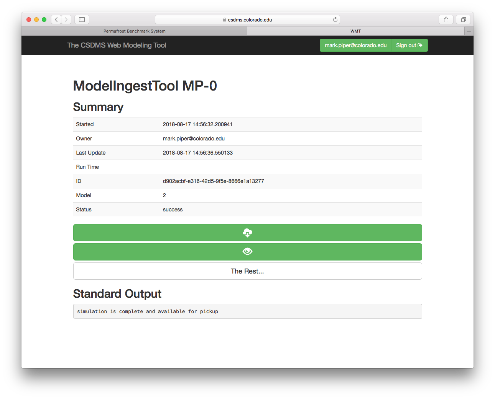

Viewing and Downloading Results
===============================

When a run completes,
the WMT Simulation Status page is shown:

   The **WMT Simulation Status** page.

On this page,
there are two buttons,
the **Download** button:

and the **Visualize** button:

Clicking the **Download** button
downloads the run results as a **tar/gz** file
to your local machine.
Instructions for unpacking these types of files
`on Windows <https://wiki.haskell.org/How_to_unpack_a_tar_file_in_Windows>`_
and
`on UNIX-based systems <http://linuxcommand.org/lc3_man_pages/tar1.html>`_
are available on the internets
through your favorite search tool.

Clicking the **Visualize** button allows
a quick visualization of the run results.
For the ModelIngestTool and the BenchmarkIngestTool,
this a simple html page
with the status of each file uploaded.
However, for ILAMB,
there's much more.
ILAMB generates a variety of tabular and graphical outputs,
and conveniently packages them in a web format.
This output from ILAMB can be viewed directly on your browser.
For example,
:numref:`fig-ilamb-output` shows the result of a benchmarking study
on the MsTMIP group of models.

.. _fig-ilamb-output:
.. figure:: ./images/PBS-ILAMB-output.png
   :scale: 50%
   :align: center
   :alt: ILAMB results page

   An example of the ILAMB results page.

All content that's viewable in your browser is also contained
in the download tarball,
along with intermediate results in NetCDF.
