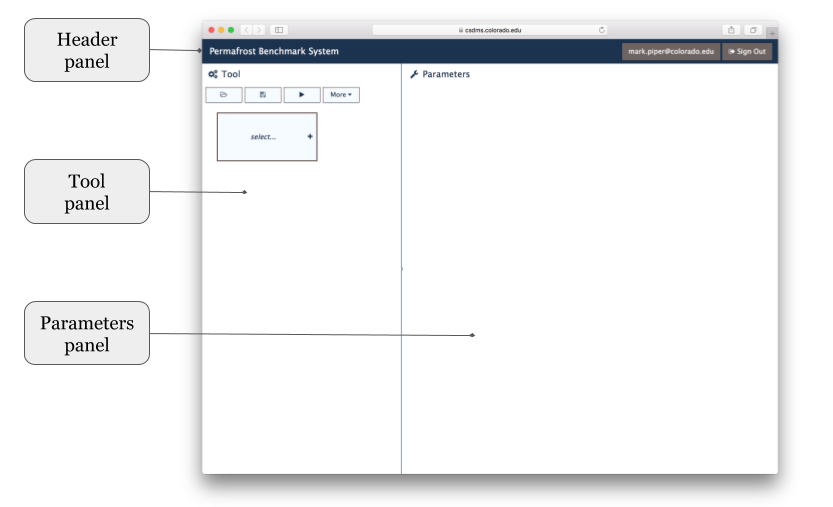

The PBS Interface
=================

The Permafrost Benchmark System (PBS) main window
is displayed after login.
It's divided into three panels:

* :ref:`header-panel`
* :ref:`tool-panel`
* :ref:`parameters-panel`

as shown in :numref:`main-window`.

.. _main-window:

   The PBS main window with its component panels.

These panels are described in the sections that follow.

.. _header-panel:

Header panel
------------

After logging in to the PBS,
the user's email address is displayed,
along with a **Sign Out** button,
on the *Header panel*.
A user must be logged in to the PBS
to upload model output files and benchmark datasets,
as well as to configure and run ILAMB.

.. _tool-panel:

Tool panel
----------

Tools, yeah.

.. _parameters-panel:

Parameters panel
----------------

Parameters, ya.
