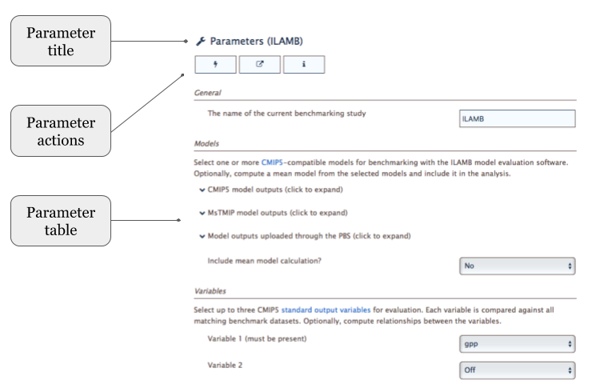

The PBS Interface
=================

The Permafrost Benchmark System (PBS) main window
is displayed after login.
It's divided into three panels:

* :ref:`header-panel`
* :ref:`tool-panel`
* :ref:`parameters-panel`

as shown in :numref:`fig-main-window`.

.. _fig-main-window:

   The PBS main window with its component panels.

These panels are described in the sections that follow.

.. _header-panel:

Header panel
------------

After logging in to the PBS,
the user's email address is displayed,
along with a **Sign Out** button,
on the *Header panel*.
A user must be logged in to the PBS
to upload model output files and benchmark datasets,
as well as to configure and run ILAMB.

.. _tool-panel:

Tool panel
----------

The Tool panel is where the PBS tools can be selected, saved, and run.
It has three components:
the Tool title, the Tool actions, and the Tool selector,
as shown in :numref:`fig-tool-panel`.

.. _fig-tool-panel:

   The PBS Tool panel with its components.

Tool title
..........

The Tool title shows the name given to a configured tool when saved.
The default title is the generic "Tool 0".
An asterisk "*" is shown next to the title
if the current tool configuration is not saved.

Tool actions
............

The Tool actions consist of a set of four buttons:
Open, Save, Run, and More. 

* Open - Presents a dialog with a list of tool configurations
  previously saved in the PBS.
* Save - Saves the tool currently displayed in the Tool panel. If this
  is the first time saving the tool, a dialog is displayed that
  allows the user to enter a name for the tool.
* Run - Runs the currently displayed tool on a computational
  resource. The tool has to be saved before it can be run.
* More - Displays a droplist with several extra items, including Save
  As, Delete, and View Run Status.

Tool selector
.............

The PBS tools can be selected from the Tool selector.
Initially, it's empty.
Pressing the button reveals the list of the three available PBS tools:

.. _fig-tool-selector:

   The PBS Tool selector, showing the available PBS tools.

Selecting ILAMB, for example, from the list results in:

.. _fig-tool-selected:

   ILAMB selected in the PBS Tool selector.

Clicking on the tool reveals the Tool options menu:

.. _fig-tool-selected-options:

   The Tool options menu for the ILAMB tool.

The three items in this menu are:

* Show parameters - Displays the parameters of the tool in
  the :ref:`parameters-panel`.
* Get information - Displays a dialog with information about the tool,
  including the author, version, and a link to the tool's help page on
  the CSDMS website.
* Close - Removes the tool from the Tool selector.

.. _parameters-panel:

Parameters panel
----------------

The Parameters panel is where the parameters of the tool
displayed in the Tool panel can be viewed and edited.
It has three components:
Parameter title, Parameter actions, and Parameter table.
This panel is initially empty.
However, when a tool is selected, the panel is populated.
For example,
the parameters of the ILAMB tool selected above look like 
:numref:`fig-parameters-panel`:

.. _fig-parameters-panel:

   The PBS Parameters panel, showing parameters of the ILAMB tool.

Parameter title
...............

The Parameter title simply shows which tool's parameters are
currently displayed.

Parameter actions
.................

The Parameter actions comprise three buttons:
Reset, View input files, and Get information.

* Reset - Resets all parameters for this model component to their
  default values.
* View input files - Shows the input files generated by the parameter
  values of the tool in either HTML, plain text, or JSON
  format.
* Get information - Displays a dialog with information about the tool.
  This action is identical to the Get information item in the Tool actions.

Parameter table
...............

Tool parameters can be viewed and edited in the Parameter table.

A default value is provided for each parameter.
When modified, each parameter is checked for type and range.
If a check fails,
the parameter value is displayed with a dark red background, as a warning.
Saving a tool configuration with warnings
will not preclude the tool from running,
but the results may be invalid.

Note that when hovering over a numeric parameter value,
the PBS will show the possible range of values for the parameter
in a tooltip (like `xkcd <https://xkcd.com/>`_).
