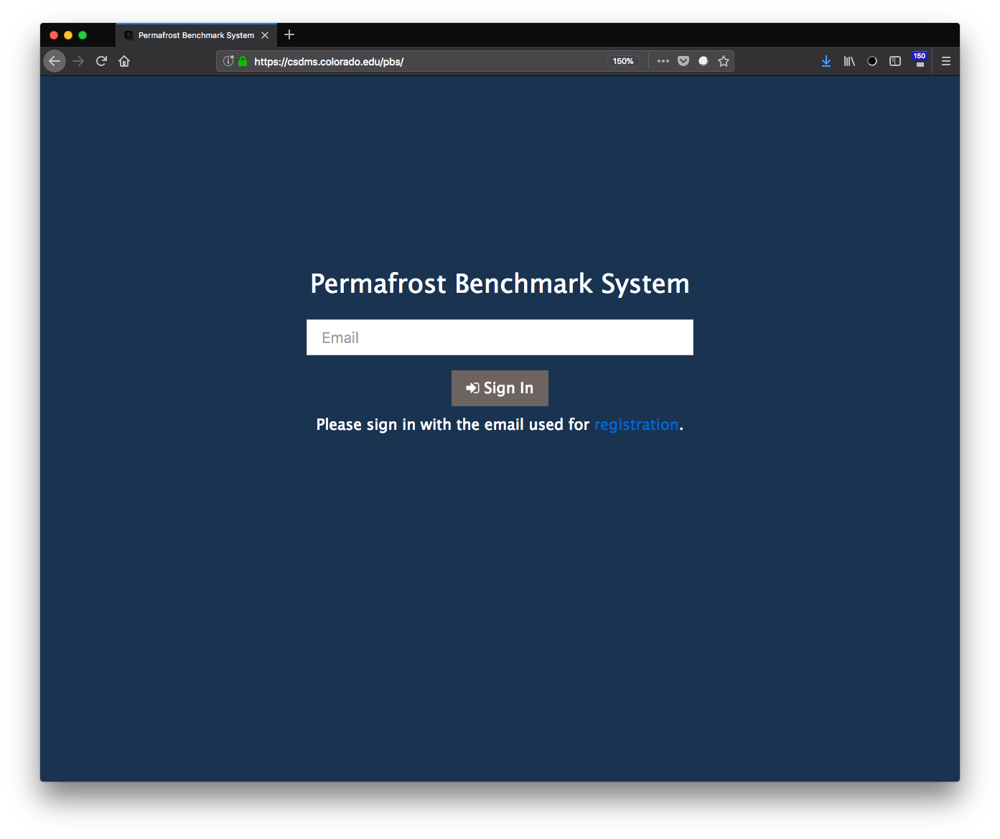

Logging in to the PBS
=====================

The Permafrost Benchmark System (PBS) login page
is located at `<https://csdms.colorado.edu/pbs>`_.

The PBS has been tested on
Firefox, Chrome, Safari, Internet Explorer, and Edge,
although it should work on any modern browser.
A screenshot of the login page is shown in :numref:`sign-in-screen` below.

.. _sign-in-screen:

   The PBS login screen.

To log in,
enter the email address used to
:doc:`register<registration>`
for the PBS
(this email address is used to tag uploaded files
and saved ILAMB runs),
then
click the **Sign In** button.
You'll be redirected to the main page of the PBS,
which is described in the section
:doc:`layout`.
