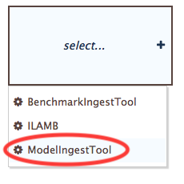
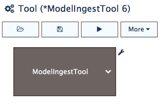
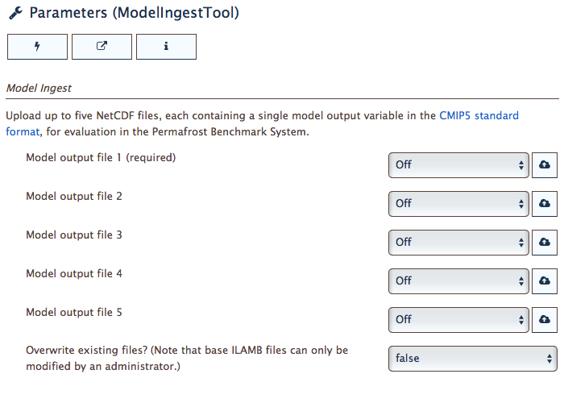

Using the ModelIngestTool
=========================

If you have model outputs 
that conform to the 
`CMIP5 standards <https://cmip.llnl.gov/cmip5/output_req.html>`_,
you can upload them to the PBS for a benchmarking analysis.
For reference,
a CMIP5-compatible file name takes the following form:

.. code-block:: bash

   filename = <variable-name>_<MIP-table>_<model>_<experiment>_<ensemble-member>[_<temporal-subset>].nc

for example:

.. code-block:: bash

   tas_Amon_HADCM3_historical_r1i1p1_185001-200512.nc
   gpp_Lmon_SiBCASA_historical_r1i1p1_198201-201012.nc

To start,
from the main PBS window,
select the **ModelIngestTool**
from the list of tools in the :ref:`tool-panel`,
as shown in :numref:`fig-select-mit`.

.. _fig-select-mit:

   Selecting the ModelIngestTool.

Once selected,
the PBS gives a generic title to the new tool.
A more specific title can chosen when
:doc:`saving the tool<save-tool>`.

.. _fig-mit-selected:

   The ModelIngestTool selected in the Tool panel.

When the ModelIngestTool loads,
its parameters are displayed
in the the :ref:`parameters-panel`.

.. _fig-mit-parameters:

   The ModelIngestTool parameters displayed in the PBS Parameters panel.

As shown in :numref:`fig-mit-parameters`,
up to five model output files can be uploaded
and processed simultaneously through this tool.
Files are uploaded locally from your computer.
If you have more than five files to upload,
you can create multiple instances of the ModelIngestTool.

The last parameter in the table provides
an option for overwriting
previously uploaded files.
This is useful, for example,
for uploading revised versions of a file.
Note, however, that you can't overwrite the model outputs
that form the base data of the PBS.
This includes the CMIP outputs included with ILAMB
and the MsTMIP outputs provided by Christopher Schwalm (NAU)
and included with the PBS.

Next steps
----------

Once you've uploaded outputs and are satisfied 
with the configuration of this tool,
the next steps are to 1) save the tool, 2) run it,
and 3) view its results.
These topics are covered in the following sections:

* :doc:`save-tool`
* :doc:`run-tool`
* :doc:`download-results`

While this section described how to upload model outputs for benchmarking,
similar actions for uploading benchmark data
are described in :doc:`benchmark-tool`.
