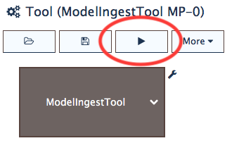
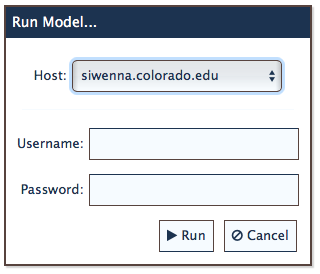
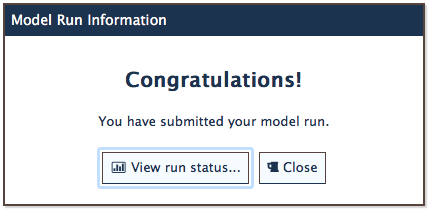
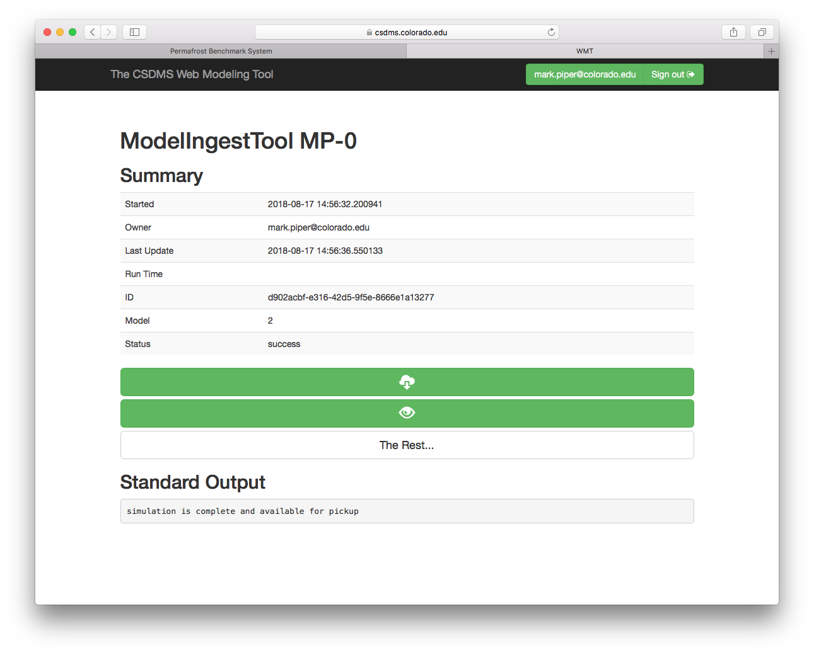

Running a Tool
==============

Once you've configured and :doc:`saved<save-tool>` a tool,
you can run it on a dedicated computational resource
at `CSDMS <https://csdms.colorado.edu>`_,
where the PBS is hosted.
To run a tool,
select the *Run* button in the :ref:`tool-panel`,
as shown in :numref:`fig-run-button`.

.. _fig-run-button:

   The *Run* button highlighted on the PBS Tool panel.

On clicking the *Run* button,
you'll be presented with a dialog,
shown in :numref:`fig-run-dialog`,
that allows you to enter the PBS login credetials
that you received after :doc:`registering<registration>`.

.. _fig-run-dialog:

   The *Run* dialog.

After successfully entering your login credentials and clicking *Run*,
the configured tool is submitted as a job
to the CSDMS computational resource,
and you're presented with a submission dialog.

.. _fig-run-submit-dialog:

   The *Run Submit* dialog.

Clicking the *View run status...* button
takes you to the **WMT Simulation Status** page,
where you can check on the status of your job.
The page updates every 10 seconds.

.. _fig-run-status-page:

   The **WMT Simulation Status** page.

When the job completes,
you can use the controls to view its output
and download the results. 

Although the :doc:`ModelIngestTool<model-tool>`
is used in this example,
the same process holds for any of the PBS tools.
