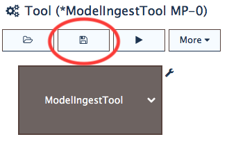
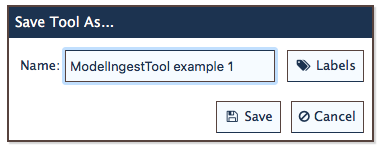

Saving a Tool
=============

To save a configured tool,
select the *Save* button in the :ref:`tool-panel`,
as shown in :numref:`fig-save-button`.

.. _fig-save-button:

   The Save button highlighted on the PBS Tool panel.

After clicking the *Save* button,
you'll be presented with a dialog
where you can change the name of the tool.

.. _fig-save-dialog:

   The Save/Save As dialog .

Although the :doc:`ModelIngestTool<model-tool>`
is used in these examples,
the same process holds for any of the PBS tools.

Note that the tool is saved in the PBS,
not locally on your computer.
Therefore, anywhere you can access the internet,
you can access the PBS and your saved tools.
For example,
you could set up a tool at your office,
save it,
and open it again on your home computer to edit it.
