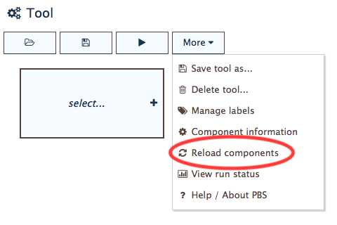
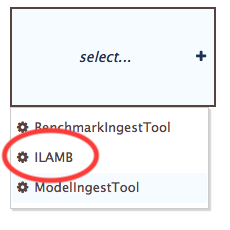
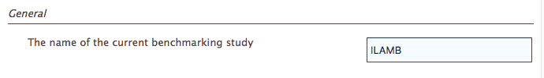
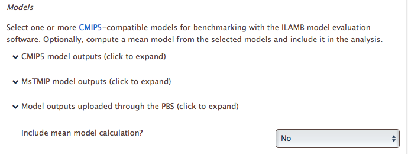
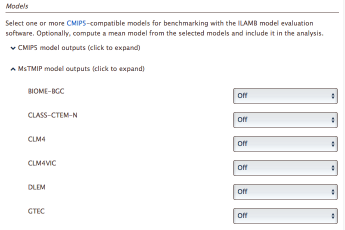
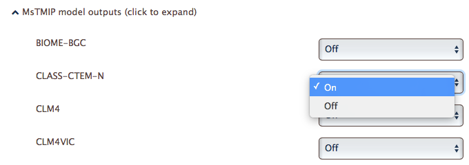

Using ILAMB
===========

`ILAMB <https://bitbucket.org/ncollier/ilamb>`_
is the engine that powers the PBS.
It's a tool that systematically confronts model outputs
with benchmark data
and creates an array of statistical comparisons
that are presented in both tabular and graphical formats.
Here,
we describe the graphical interface to ILAMB
presented by the PBS.

Loading PBS files
-----------------

In a **very important** first step,
for ILAMB to see any files uploaded through
the BenchmarkIngestTool or the ModelIngestTool,
its interface in the PBS needs to be refreshed.
To do so,
as shown in :numref:`fig-reload-ilamb`,
open the **More** menu from the buttons
atop the :ref:`tool-panel`
and select **Reload components**.

.. _fig-reload-ilamb:

   Loading PBS files for the ILAMB interface.

Selecting this menu item will force the ILAMB interface
to recognize any new files that have been uploaded.
Afterward, the ILAMB tool can be used,

.. _configuring-ilamb:

Configuring ILAMB parameters
----------------------------

To begin,
from the main PBS window
select **ILAMB**
from the list of tools in the :ref:`tool-panel`,
as shown in :numref:`fig-select-ilamb`.

.. _fig-select-ilamb:

   Selecting ILAMB from the PBS tool list.

When ILAMB loads,
its parameters are displayed
in the the :ref:`parameters-panel`.
There are four sections in the set of ILAMB parameters.
Let's go over each in turn.

General section
...............

First,
in the *General* section,
a text field allows you to attach a name to the ILAMB run.

.. _fig-ilamb-general:

   The *General* section of the ILAMB tool parameters

This isn't the same as the configured tool title 
set in the :doc:`Save menu<save-tool>`,
but it appears as a header on the output from the ILAMB run.

Models section
..............

Next is the *Models* section.
It has three collections of models,
listed by name,
including

#. `CMIP5 <https://cmip.llnl.gov/>`_, provided by Minquan Mu (UC-Irvine
   and ILAMB team);
#. `MsTMIP <https://nacp.ornl.gov/MsTMIP.shtml>`_, provided by
   Christopher Schwalm (NAU);
#. Any model outputs uploaded to the PBS through the ModelIngestTool.

These collections are shown in :numref:`fig-ilamb-models-1`.
The outputs from these models can be confronted
by benchmark data using the ILAMB tool.

.. _fig-ilamb-models-1:

   The *Models* section of the ILAMB tool parameters

To select model outputs to be confronted in ILAMB,
click to expand a collection,
then flip a model's toggle from "Off" to "On".
This is demonstrated below in :numref:`fig-ilamb-models-2`
and :numref:`fig-ilamb-models-3`
for the CLASS-CTEM-N model in the MsTMIP collection.

.. _fig-ilamb-models-2:

   Expanding the collection of MsTMIP models in the *Models* section.

.. _fig-ilamb-models-3:

   Selecting the CLASS-CTEM-N model from the MsTMIP collection.

Variables section
.................

The *Variables* section contains three lists of variables,
containins CMIP5 short names,
that correspond to datasets for benchmarking.

From one to three benchmark variables.

A default has been chosen for the first variable,
but it can be changed.

ILAMB has the capability to
calculate relationships
between benchmark variables..
(ref ILAMB docs)

Regions section
...............

Global is "On", by default.

Can select GFED regions.

Can upload custom region.
Instructions for creating a custom region file that can be read
and processed by ILAMB are given in the ILAMB docs. (Ref)

Next steps
----------

Once you've uploaded data and are satisfied 
with the configuration of this tool,
the next steps are to 1) save the tool, 2) run it,
and 3) view its results.
These topics are covered in the following sections:

* :doc:`save-tool`
* :doc:`run-tool`
* :doc:`download-results`

While this section described how to upload benchmark data,
similar actions for uploading model outputs
are described in :doc:`model-tool`.

